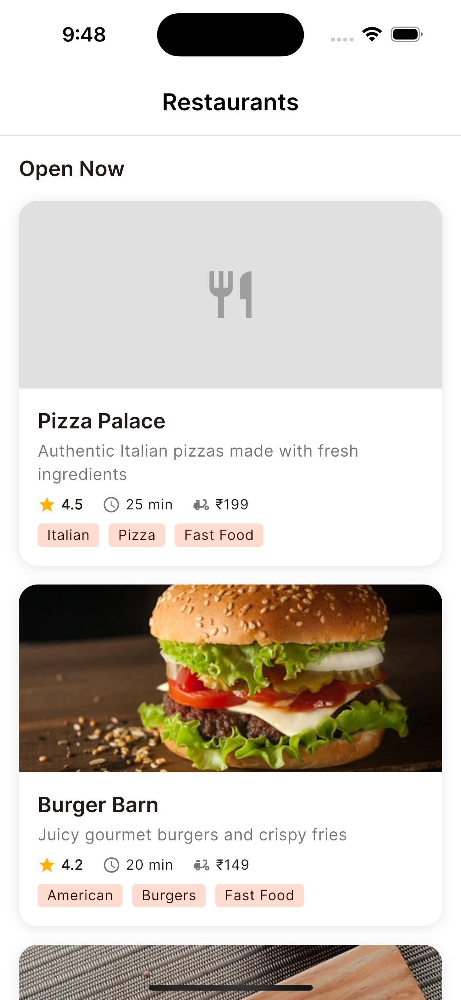
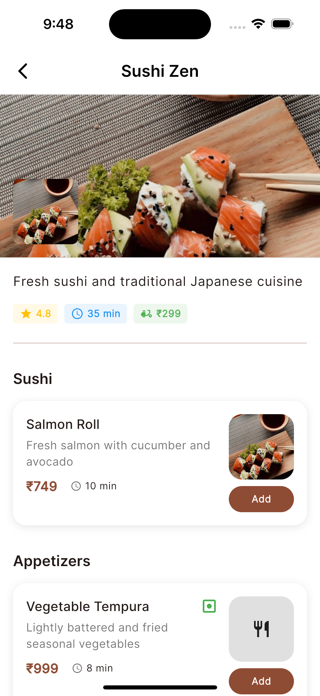
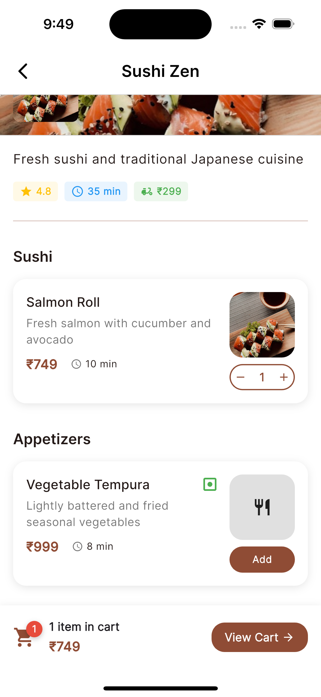
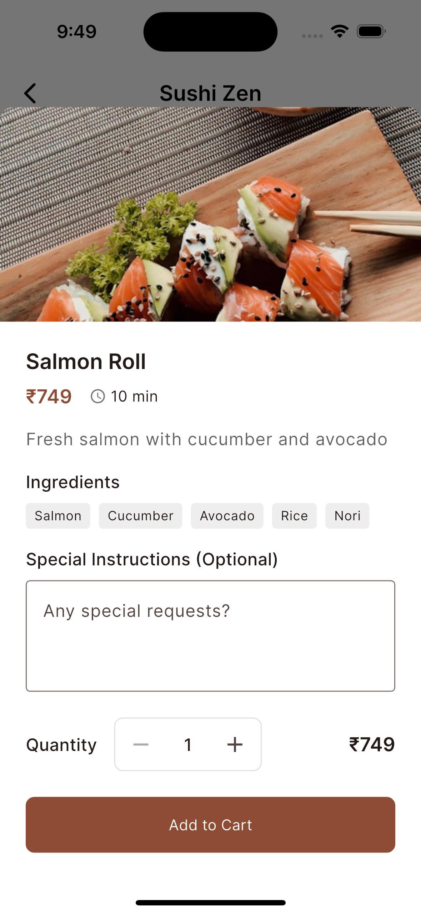
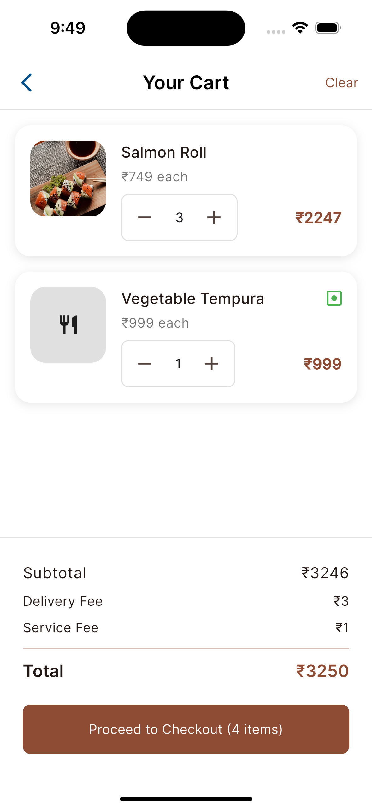
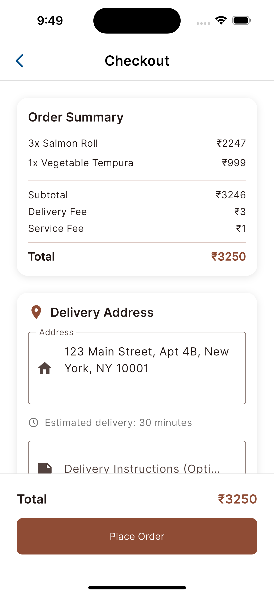
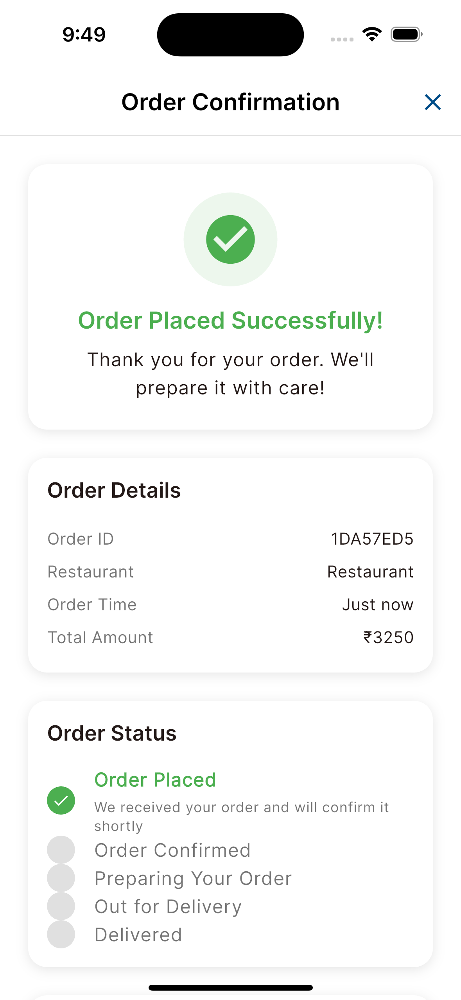
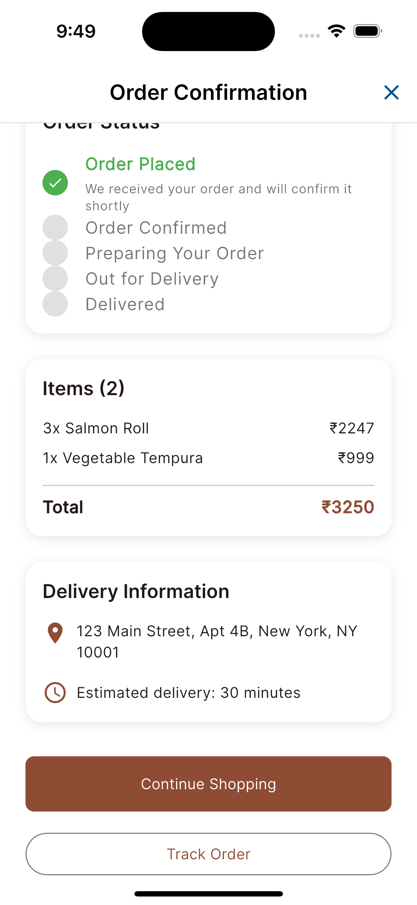
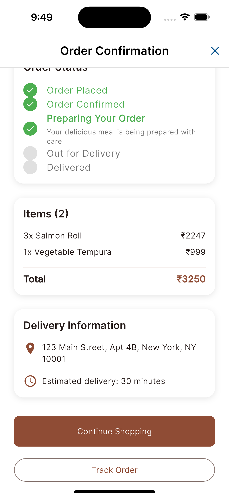

# Restaurants App

### Technical Features
- **BLoC Architecture**: Reactive state management with flutter_bloc
- **Comprehensive Testing**: Unit tests for BLoCs, models, and services
- **SOLID Principles**: Clean, maintainable, and extensible code structure
- **Mock Data**: Realistic mock data with simulated network delays and failures
- **Type Safety**: Full type safety with null safety enabled

## 📱 Screenshots

### Restaurants
*Browse available restaurants with ratings and delivery information*


### Menu
*Explore detailed menu items with rich information*




### Cart
*Manage your order with quantity controls and special instructions*


### Checkout
*Complete your order with delivery details*


### Order
*Track your order status in real-time*





## Installation & Setup

1. **Clone the repository**
   ```bash
   git clone <repository-url>
   ```

2. **Install dependencies**
   ```bash
   flutter pub get
   ```

3. **Run the application**
   ```bash
   flutter run
   ```

*This project demonstrates modern Flutter development practices including clean architecture, comprehensive testing, and beautiful UI design.*
